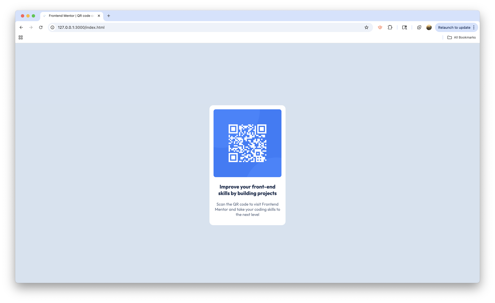

# Frontend Mentor - QR code component solution

This is a solution to the [QR code component challenge on Frontend Mentor](https://www.frontendmentor.io/challenges/qr-code-component-iux_sIO_H). Frontend Mentor challenges help you improve your coding skills by building realistic projects. 

## Table of contents

- [Overview](#overview)
  - [Screenshot](#screenshot)
  - [Links](#links)
- [My process](#my-process)
  - [Built with](#built-with)
  - [What I learned](#what-i-learned)
  - [Continued development](#continued-development)
  - [Useful resources](#useful-resources)

## Overview

### Screenshot



### Links

- My Solutioon Live Site URL: [Add live site URL here](https://cethatch.github.io/qr-component/)

## My process

### Built with

- Semantic HTML5 markup
- CSS custom properties
- Flexbox

### What I learned

Flexbox is a really neat CSS layout tool! I first learned about it in my web dev class while getting my degree. To be perfectly honest, I didn't completely understand it then, but I'm feeling a lot more confident with it these days. I used Flexbox to center the QR code component in the middle of the viewport for this project: 

```css
body {
    display: flex;
    justify-content: center;
    align-items: center;
}
```

### Continued development

In future projects, I will continue working on creating optimal CSS with less redundancy. While working on this project, I tried to focus on where certain HTML tags and CSS properties were really necessary, and which could be eliminated. This is still a work in progress, and one that I'm sure will improve with experience!

### Useful resources

- [CSS Flexbox](https://css-tricks.com/snippets/css/a-guide-to-flexbox/) - Anytime I'm working with Flexbox, I have this webpage open. I find it to be a fantastic resource that helps me visualize different CSS Flexbox properties and their values.

- [Markdown Guide] (https://www.markdownguide.org/) - Helped me write this doc using Markdown!

